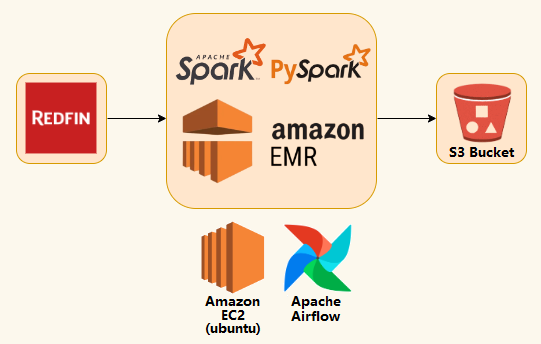

# Redfin Data Pipeline with EMR Integration

## Overview
This project leverages Apache Airflow to orchestrate a seamless data pipeline that involves running EMR jobs for data processing. It extracts data from the Redfin Datacenter web address, performs data transformations using Spark and PySpark, and efficiently loads both raw and transformed data into an S3 bucket.

## Architecture

## Technology used
1. Bash Script
2. Python
3. Apache Spark (PySpark)
4. Apache Airflow
5. Amazon Web Service (AWS)
- EMR
- S3
- EC2 (Ubuntu)
- IAM
- VPC

